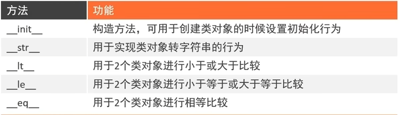

# Python基础到精通
## git环境代理
```angular2html
git config --global http.proxy http://127.0.0.1:7890
git config --global https.proxy http://127.0.0.1:7890
```
取消代理
```angular2html
git config --global --unset http.proxy
git config --global --unset https.proxy
```
## 1 Day
## 序章
### 编程语言是人类与计算机沟通的桥梁
一个是自然语言一个是二进制  
通过解释器改成2进制,解释器:python.exe
### 使用方法
#### 控制台
cmd 输入python (进入python环境)然后就可以写代码  
输入exit()退出
#### 文件
后缀改为.py  
cmd运行文件 python 文件名.py
## 2 Day
### 字面量
数字,字符串,列表,元组,集合,字典
### 注释
用# 开头一般中间使用一个空格隔开

多行注释一般用"""注释"""
### 变量
变量无类型
#### 输出变量的方式
输出字面量,变量要用,隔开
1. print('我是',变量名,变量名)
2. print(f"我是{变量名} {变量名}")把变量原原本本移动过来,不用控制精度
3. print("我是"+变量名+变量名)//这里是字符串的拼接,变量要*str*类型
4. print("我是%s %s"%(变量名,变量名))//字符串格式化,占位符,多个变量用括号裹起来,需要控制精度

s表示将变量变成字符串放入占位的地方,%表示占位符,%s表示字符串,%d表示整数,%f表示小数,%c表示字符
#### 字符串格式化
使用m.n控制数据宽度和精度,

m表示宽度,不够就在前面加空格小于或等于本身无影响,

.n表示精度,n为小数位数同时会进行四舍五入

#### 表达式也能格式化
把变量的位置替换成表达式能简化书写
### 数据类型
一般int float string

type(变量)可以查看变量和字面量的数据类型

#### 字符串三种定义方式
1. 单引号''
2. 双引号""
3. 三引号""" """(赋值就是字符串,没赋值就是注释)
#### 怎么在字符串中输出引号
1. "'a'"
2. '"a"'
3. "\"a\""(使用反斜杠转义\)
4. '\"a\"'
# 注意
## 函数与方法
函数:函数名(参数)

方法:对象.方法名(参数)

方法可能有返回值,也可能只是对对象进行操作
### 数据类型转换
1. int()
2. float()
3. str()
### 标识符命名规则
不能数字开头

大小写敏感

不能使用关键字

可以中文但不建议

#### 规范
简介明了

多个单词组合使用下划线分隔

变量英文字母尽量小写
### 算数运算符
+- * / ** % //

复合数字运算符

a+=b
### 输入
input()
1. print(input())直接输入
2. input("请输入:")有输入提示信息
得到的输入都是字符串
## Day3
### 布尔类型和比较运算符
布尔类型:True False
==比较的是值
is比较的是内存地址
### 条件判断
if 条件:

    满足条件执行的代码

elif 条件:

    满足条件执行的代码
elif 条件:

    满足条件执行的代码
else:

    不满足条件执行的代码

可以通过空格缩进嵌套
## Day4
### 循环
while 条件:
    满足条件执行的代码

0<n是n次

0<=1是n+1次

1<n是n-1次

1<=n是n次
### 输出不换行
换行
```python
print()
```
不换行
```python
print("a",end="")
```
```python
print("b",end="")
```
相当于tab键能进行多行字符串对齐
```python
print("c\td")
```
换行
```python
print("a\nb")
```

### for循环
```
for 临时变量 in 待处理数据集:
    满足条件执行的代码
```
*无法构建无限循环*

待处理数据集严格称为序列类型
1. 字符串
2. 列表
3. 元组等
#### range()生成数字序列
1. range(n)从0开始小于n
2. range(a,b)从a开始小于b
3. range(a,b,c)从a开始依次+c到小于b

### 临时变量在作用域外可以访问，但是不规范，可以提前定义
```python
i=0
for i in range(9):
    i+=1
print(i)
```
作为临时变量带来的变化并没有被销毁

### 循环嵌套只需要注意缩进
### 循环中断
continue:跳过本次循环，进入下一次

break:终止循环

都只对当前循环生效，不影响外层

### 对象
可以看作纸张表，分为设计表，打印表，填写表
类名首字母大写，其他还是python规则
#### 设计类
```python
# 设计类（设计表）
class Student:
    name=None
    gender=None
    age=None
# 创建对象（打印表）
stu_1=Student()
# 对象赋值（填写表）
stu_1.name="cjr"
stu_1.gender="男"
stu_1.age=21
# 获取信息
print(stu_1.name)
```
案例
```python
# 设计类
class Student:
    name=None# 成员变量
    gender=None
    age=None
    def say_hi(self):#成员方法，
        # self在传参中可以忽略
        # 表示对象自身
        # 访问成员变量必须使用
        print(f"Hi大家好，我是{self.name}")
# 创建对象
stu_1=Student()
# 对象赋值
stu_1.name="cjr"
stu_1.gender="男"
stu_1.age=21
# 获取信息
print(stu_1.name)
```
### 构造方法__init__()
创建对象时会自动运行
```
def __init__(self,name,gender,sex):
    self.name=name
    self.gender=gender
    self.sex=sex
Student("cjr","男","21")
```
### 魔术方法(__name__格式)
看案例

### 封装
将现实世界的事物描述为属性和方法
#### 私有成员，方法以__开头
不能通过创建对象调用

能在类内部使用,定义不直接对用户开放的属性和行为
